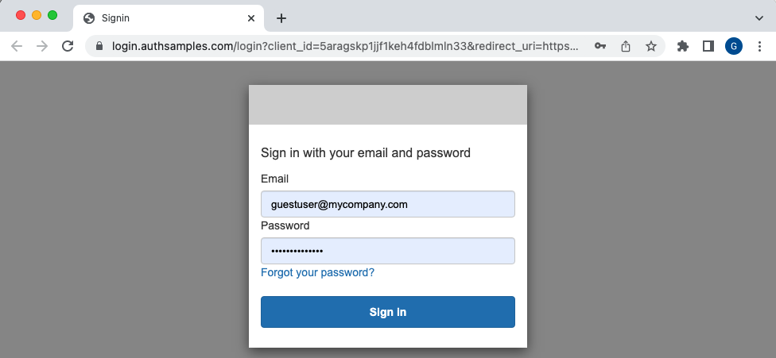
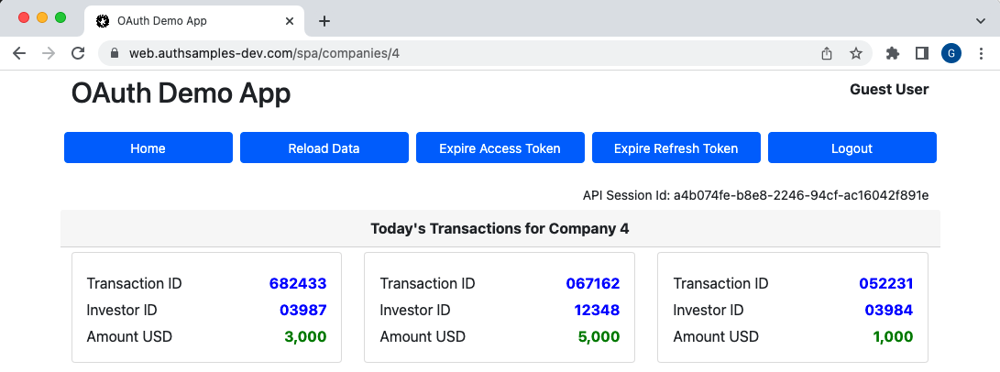
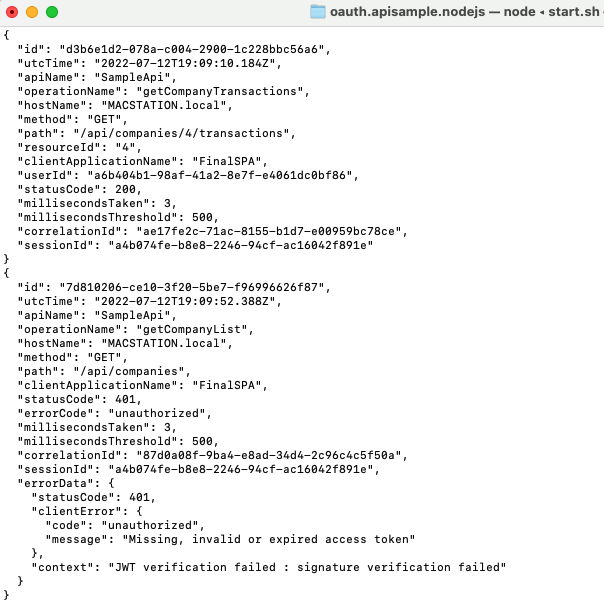

# Elasticsearch Log Aggregation

Resources for deploying the Elastic Stack and using it to aggregate API logs.\
The following notes describe the default local development setup.

## Prerequisites

First ensure that Docker and Node.js are installed.

## Deploy the Elastic Stack

Then run the following script to deploy the Elastic Stack components to the local computer:

```bash
./deployment/docker-local/deploy.sh
```

## DNS and SSL Configuration

Next add DNS domains to the local computer by editing the hosts file:

```text
127.0.0.1  localhost api.authsamples-dev.com web.authsamples-dev.com localtokenhandler.authsamples-dev.com logs.authsamples-dev.com
```

Next trust the root certificate by adding it to your computer's SSL trust store:

```text
deployment/docker-local/certs/authsamples-dev.ca.pem
```

## Connect to the Elastic Stack

Next connect to the ElasticSearch API to which logs will be sent:

```bash
curl -u 'elastic:Password1' https://logs.authsamples-dev.com:9200
```

Then login to Kibana at https://logs.authsamples-dev.com:5601/app/dev_tools#/console with credentials `elastic / Password1`:


## Application Setup

First run an integrated SPA and API solution in a parallel folder to generate logs visually.\
Start by running one of this blog's final APIs in a parallel folder:

- [Final Node.js API](https://github.com/gary-archer/oauth.apisample.nodejs)
- [Final .NET API](https://github.com/gary-archer/oauth.apisample.netcore)
- [Final Java API](https://github.com/gary-archer/oauth.apisample.javaspringboot)

If the Node.js API is used then the following commands would be run:

```bash
cd ..
git clone https://github.com/gary-archer/oauth.apisample.nodejs
cd oauth.apisample.nodejs
./start.sh
```

Next run this blog's final SPA against the local API:

```bash
cd ..
git clone https://github.com/gary-archer/oauth.websample.final
cd oauth.websample.final
./build.sh LOCALAPI
./run.sh LOCALAPI
```

When the system browser is opened, sign in with credentials `guestuser@mycompany.com / GuestPassword1`:



You will then be able to view the SPA, whose session ID is written to API logs:



You will also see the API and the logs generated, which are output to both console and log files:



## Analyze API Logs

Analyse logs generated from your SPA activityy.\
For example, long press the Reload Data button to cause an API exception.\
Then slice and dice the error data via [SQL or Lucene queries](https://authguidance.com/api-technical-support-analysis/):

```text
GET apilogs*/_search
{ 
  "query" :
  {
    "match" :
    {
      "errorId" : 30229
    }
  }
}
```

SCREENSHOT

Alternatively look at recent log entries using the Live Analysis view:

SCREENSHOT

## Free Docker Resources

Run these commands to tear down all Docker containers:

```bash
cd logaggregation.elasticsearch
./deployment/docker-local/teardown.sh
cd ../oauth.websample.final
./localtokenhandler/deployment/docker-local/teardown.sh
```
