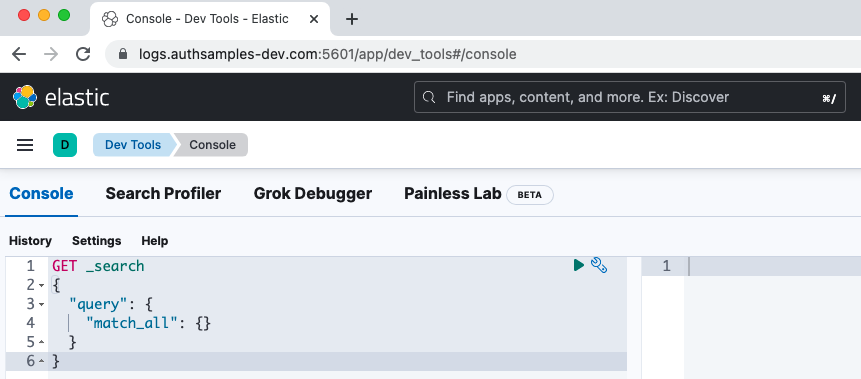

# Elasticsearch Log Aggregation

Resources for deploying the Elastic Stack so that it can be used to aggregate API logs.\
This is part of an overall [Effective API Logging](https://authguidance.com/effective-api-logging/) design.

## Deployments

The following notes describe a Docker based local development setup.\
For an end-to-end Kubernetes example, run the [Cloud Native Deployment](https://github.com/gary-archer/oauth.cloudnative.deployment) instead.

### Configure DNS and SSL

On the first install, run the following script:

```bash
./deployment/docker-local/downloadcerts.sh
```

Add the External URL for Elasticsearch and Kibana to your hosts file:

```text
127.0.0.1  localhost logs.authsamples-dev.com
```

Also trust the root certificate by adding it to your computer's SSL trust store:

```text
./deployment/docker-local/certs/authsamples-dev.ca.pem
```

### Deploy the Elastic Stack

Then run the following script to deploy Elastic Stack components to Docker:

```bash
./deployment/docker-local/deploy.sh
```

### Connect to Elasticsearch

Next connect to the Elasticsearch API to which API logs will be sent:

```bash
curl -k -u 'elastic:Password1' https://logs.authsamples-dev.com:9200
```

This brings back the default result with information about the cluster:

```json
{
  "name" : "elasticsearch-internal.authsamples-dev.com",
  "cluster_name" : "docker-cluster",
  "cluster_uuid" : "l295GnGkT86UA1NrqtbFXA",
  "version" : {
    "number" : "8.4.1",
    "build_flavor" : "default",
    "build_type" : "docker",
    "build_hash" : "2bd229c8e56650b42e40992322a76e7914258f0c",
    "build_date" : "2022-08-26T12:11:43.232597118Z",
    "build_snapshot" : false,
    "lucene_version" : "9.3.0",
    "minimum_wire_compatibility_version" : "7.17.0",
    "minimum_index_compatibility_version" : "7.0.0"
  },
  "tagline" : "You Know, for Search"
}
```

### Login to Kibana

Then login to Kibana at the following URL, using credentials `elastic / Password1`:

- https://logs.authsamples-dev.com:5601/app/dev_tools#/console



### Understand Filebeat Log Shipping

Filebeat picks up logs from these locations within its container:

```yaml
filebeat.inputs:
- type: log
  paths:
  - /var/log/nodejsapi/*.log
  - /var/log/netcoreapi/*.log
  - /var/log/javaapi/*.log
  - /var/log/oauthagent/*.log
```

In the `docker-compose.yml` file these map to the following folders shared from the host computer:

```text
../oauth.apisample.nodejs/logs
../oauth.apisample.netcore/logs
../oauth.apisample.javaspringboot/logs
../oauth.tokenhandler.docker/logs
```

### Run a Local API to Generate Logs

Follow these blog posts to run one of my Final APIs.\
The posts describe how a basic load test can be run to generate logs:

- [Node.js API](https://authguidance.com/api-architecture-node/)
- [.NET API](https://authguidance.com/net-core-code-sample-overview/)
- [Java API](https://authguidance.com/java-spring-boot-api-overview/)

Optionally also connect the Final SPA to the local API, and diagnose your own UI activity:

- [Final SPA](https://authguidance.com/final-spa-overview/)

### Analyse Logs

First run a Kibana query to verify that logs are being received:

```text
GET apilogs*/_search
```

Log entries from multiple APIs are received, where the `_source` object contains useful fields to query by:

```json
{
  "_index": ".ds-apilogs-2022.07.15-2022.07.15-000001",
  "_id": "f1c38406-6d1e-212f-ee8b-e100a4219b28",
  "_score": 1,
  "_source": {
    "hostName": "MACSTATION.local",
    "apiName": "SampleApi",
    "method": "GET",
    "millisecondsTaken": 10,
    "errorCode": "unauthorized",
    "operationName": "getCompanyList",
    "errorData": {
      "context": "No access token was supplied in the bearer header",
      "clientError": {
        "code": "unauthorized",
        "message": "Missing, invalid or expired access token"
      },
      "statusCode": 401
    },
    "path": "/api/companies",
    "@timestamp": "2022-07-15T17:34:28.631Z",
    "millisecondsThreshold": 500,
    "correlationId": "b868385c-e8fa-9496-9d5b-492158e3d555",
    "id": "f1c38406-6d1e-212f-ee8b-e100a4219b28",
    "statusCode": 401
  }
}
```

You can then issue a collection of SQL or Lucene queries to slice and dice the API logs.\
For a set of technical support queries, see the [API Platform Technical Analysis](https://authguidance.com/api-technical-support-analysis) page.

### Free Docker Resources

When finished with logging, run this command to tear down all Elastic Stack resources:

```bash
./deployment/docker-local/teardown.sh
```
